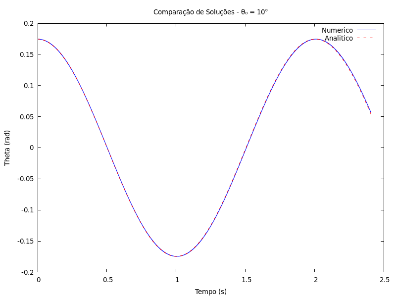
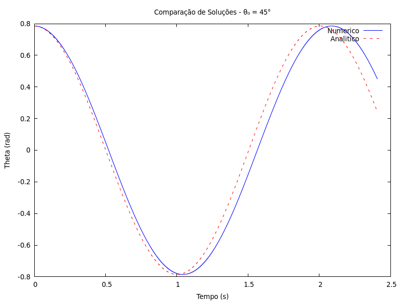
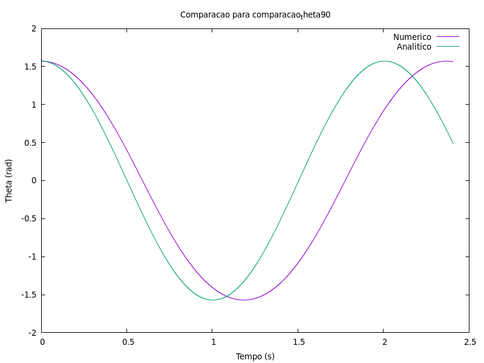
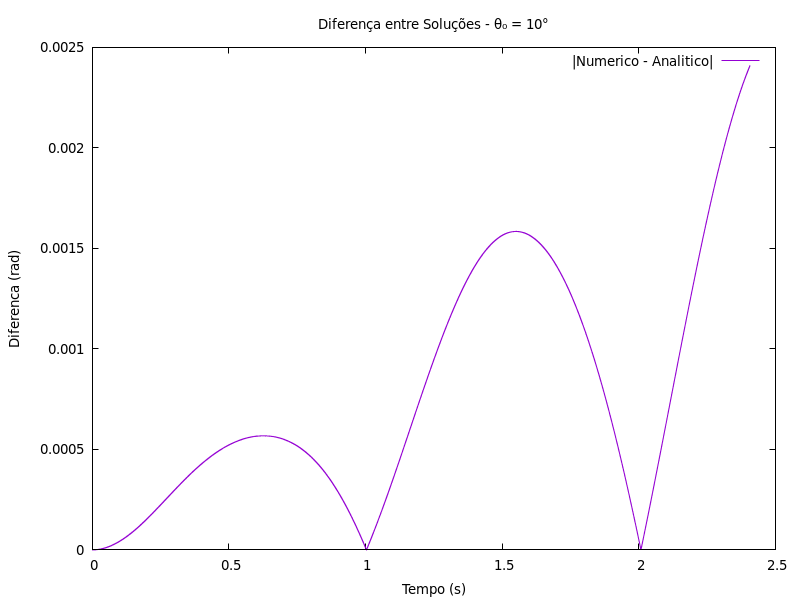
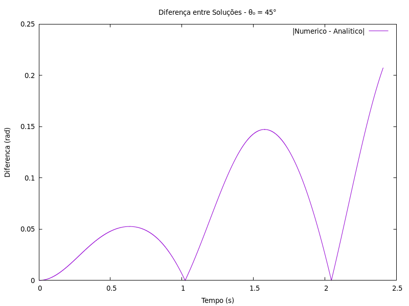
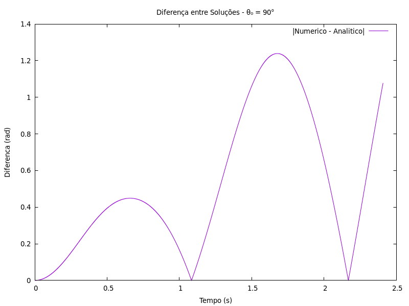

---

## Introdução

Este trabalho aborda o estudo do movimento do pêndulo simples, um problema clássico da física que demonstra conceitos importantes sobre oscilações e equações diferenciais. O objetivo principal do projeto é utilizar o método numérico de Runge-Kutta de 4ª ordem (RK4) para resolver a equação diferencial não linear que descreve o movimento do pêndulo.

A solução numérica obtida é então comparada com a solução analítica simplificada, que é válida apenas para pequenas amplitudes de oscilação. Para otimizar a precisão e a eficiência computacional, o método RK4 foi implementado tanto com passo constante quanto com uma estratégia de passo adaptativo, que ajusta o tamanho do passo para manter o erro local sob um limite pré-definido de $\varepsilon = 10^{-5}$.

O relatório apresenta o desenvolvimento do modelo matemático e dos métodos numéricos empregados, seguido por uma análise detalhada dos resultados computacionais, comparando a precisão, o custo computacional e a validade das diferentes abordagens para vários ângulos iniciais.

---

## Desenvolvimento

O movimento de um pêndulo simples, de comprimento $L$ sob a ação da gravidade $g$, é descrito pela seguinte equação diferencial ordinária (EDO) de segunda ordem:

$$
\frac{d^{2}\theta}{dt^{2}} + \frac{g}{L}\sin(\theta) = 0
$$

Onde $\theta$ é o ângulo em relação à vertical. Esta é uma EDO não linear devido ao termo $\sin(\theta)$. Para resolvê-la numericamente, primeiro a convertemos em um sistema de duas EDOs de primeira ordem, definindo $\omega = d\theta/dt$ (velocidade angular):

1. $\dfrac{d\theta}{dt} = \omega$
2. $\dfrac{d\omega}{dt} = -\dfrac{g}{L} \sin(\theta)$

Este sistema foi resolvido utilizando o **método de Runge-Kutta de 4ª Ordem**. A implementação foi feita em linguagem C, contemplando duas estratégias principais de integração:

- **Passo Fixo:** O método RK4 foi aplicado com três passos constantes diferentes ($h = 0.01 \, \text{s}$, $h = 0.001 \, \text{s}$ e $h = 0.0001 \, \text{s}$) para avaliar o impacto do tamanho do passo na precisão e no custo computacional.
- **Passo Adaptativo:** Foi implementada uma estratégia de passo adaptativo para otimizar a simulação. A cada passo, o erro local é estimado comparando o resultado de um passo $h$ com dois passos $h/2$. Se o erro for maior que a tolerância $\varepsilon = 10^{-5}$, o passo é reduzido; se for muito menor, o passo é aumentado para o passo seguinte. Esta abordagem visa garantir a precisão desejada com o menor número de cálculos possível.

Para fins de comparação, também foi utilizada a **solução analítica aproximada**, derivada da linearização $\sin(\theta) \approx \theta$ para pequenos ângulos. Esta aproximação transforma a EDO em um oscilador harmônico simples com solução:

$$
\theta(t) = \theta_0 \cos\!\left(\sqrt{\frac{g}{L}}\, t\right)
$$

cujo período é constante e dado por:

$$
T \approx 2\pi \sqrt{\frac{L}{g}}.
$$

O período $T$ do ciclo foi calculado numericamente monitorando a mudança de sinal da velocidade angular $\omega$, utilizando interpolação linear para estimar o instante exato da inversão e, consequentemente, o meio período. Para maior precisão, o tempo de 10 períodos foi medido e então dividido por 10.

---

## Resultados e Análise

Esta seção apresenta os resultados obtidos através dos experimentos computacionais, focando na comparação entre a solução numérica e a analítica, na eficiência dos métodos e na dependência do período com a amplitude.

### Validade da Aproximação Linearizada

Os experimentos confirmam que a solução analítica simplificada só é precisa para ângulos iniciais pequenos. O erro da aproximação cresce rapidamente com o aumento do ângulo inicial $\theta_0$.

- **Limite de Erro:** Nossos testes indicam que para um ângulo inicial **$\theta_0 \leq 5^\circ$**, o erro absoluto no período é inferior a $0{,}001 \, \text{s}$, satisfazendo o critério do enunciado.
- **Análise Gráfica:** Os gráficos de comparação ilustram visualmente essa divergência. Para $\theta_0 = 10^\circ$, as curvas numérica e analítica são quase indistinguíveis. No entanto, para $\theta_0 = 45^\circ$ e, de forma mais acentuada, para $\theta_0 = 90^\circ$, a solução analítica se afasta significativamente da solução numérica, que representa o comportamento físico mais preciso.

_Figura 1: Comparação entre a solução numérica (azul) e a analítica (vermelho tracejado) para um ângulo inicial de 10°._

_Figura 2: Comparação para 45°._

_Figura 3: Comparação para 90°._

Os gráficos de diferença, calculados como

$$
\left| \theta*{\text{num}} - \theta*{\text{anal}} \right|,
$$

quantificam o erro ao longo do tempo.

### Eficiência dos Métodos e Análise do Período

A análise do período e do número de passos revela a superioridade do método adaptativo.

| Ângulo Inicial ($\theta_0$) | Período (Adaptativo) | Passos ($h=0{,}0001$) | Passos (Adaptativo) | Redução |
| --------------------------: | -------------------: | --------------------: | ------------------: | ------: |
|                         45° |           2.086253 s |                300910 |                 473 |   ~636x |
|                         90° |           2.367843 s |                300910 |                 501 |   ~600x |
|                        120° |           2.754091 s |                300910 |                 548 |   ~550x |

Além disso, ao contrário do modelo linearizado que prevê período constante ($T \approx 2{,}006$ s), os resultados numéricos mostram que o **período aumenta com a amplitude inicial**. Exemplos:

- $\theta_0 = 5^\circ$: $T \approx 2{,}007$ s
- $\theta_0 = 150^\circ$: $T \approx 3{,}535$ s

### Análise de Tempo de Execução

Para $\theta_0 = 90^\circ$, a simulação de 10 períodos (≈ 24 s reais) levou apenas $0{,}11$ ms — mais de **20.000× mais rápido** que o tempo físico.

---

## Conclusão

Este trabalho realizou com sucesso a simulação do pêndulo simples utilizando RK4 com passo fixo e adaptativo. A abordagem adaptativa foi significativamente mais eficiente. Confirmou-se também que a aproximação linearizada só é válida para pequenas amplitudes e que o período real aumenta conforme $\theta_0$ cresce.

---

## Referências

[1] Press, W. H., et al. _Numerical Recipes in C_.  
[2] Butcher, J. C. _Numerical Methods for ODEs_.  
[3] INF1608 — Enunciado do trabalho.
